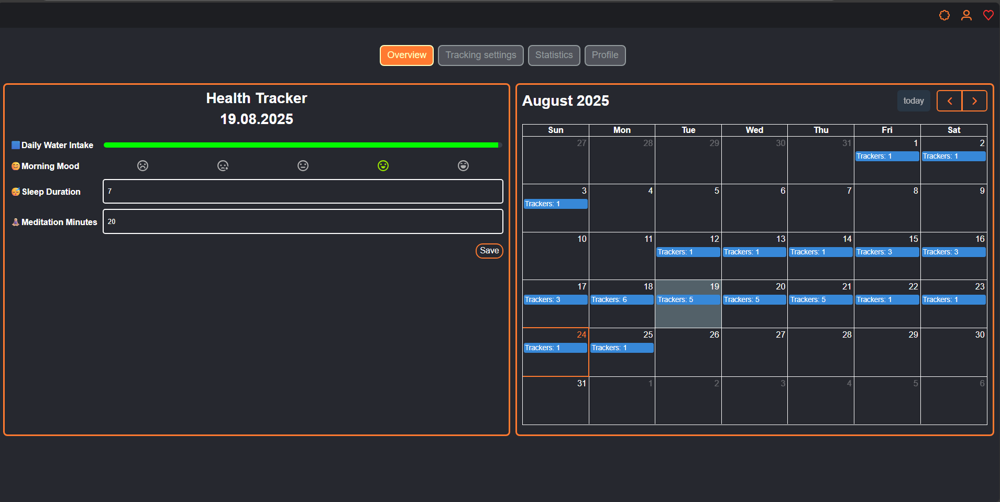
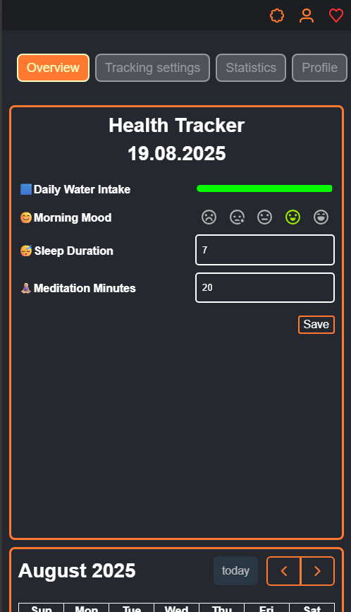
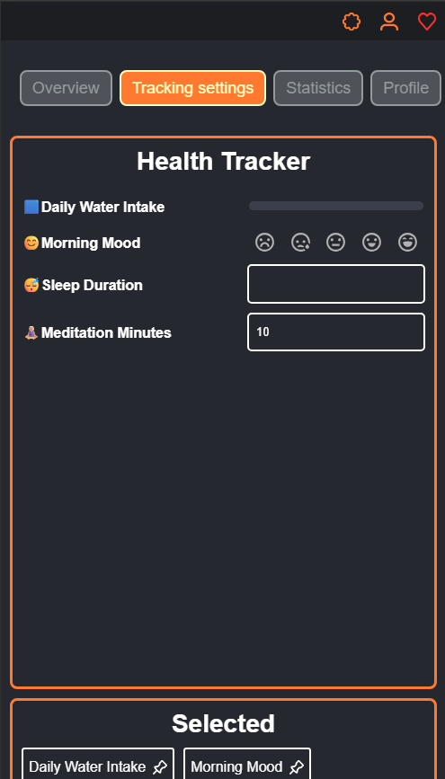
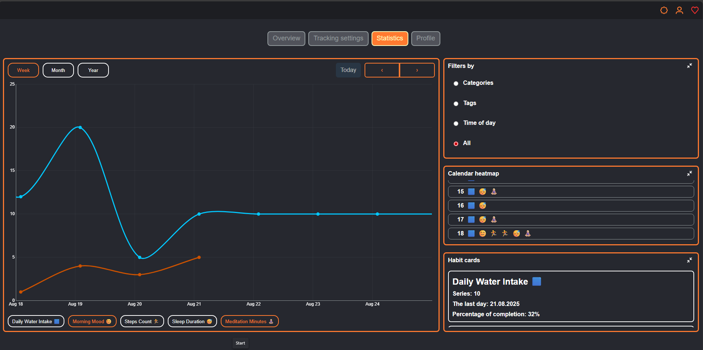
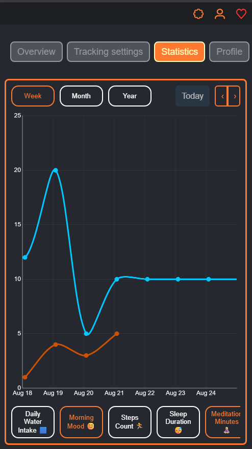
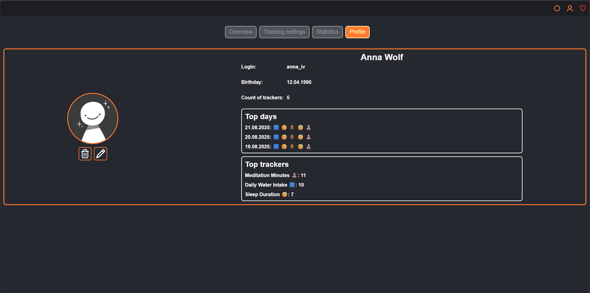
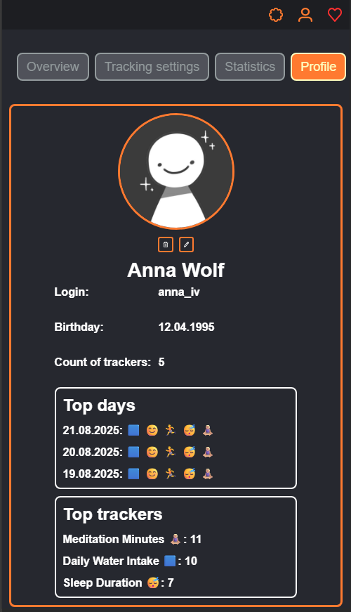

========================
Health Tracker (Angular)

Personal health tracking app built with Angular. Designed to demonstrate frontend skills, UX thinking, and component-based architecture.

Live demo: https://alfereva-dev.github.io/health-tracker/

========
Features

Create custom trackers with types: Number, Slider, Emoji Scale, Select, Multiple Choice, Checkbox, Text

Color & icon pickers via enums (Colors, Emoji)

Category (single select) and Tags (multi select) sourced from user data

Calendar overview (FullCalendar) – jump to a date and view/edit entries

Responsive UI — adaptive layouts for mobile, tablet, and desktop (touch-friendly controls, grid-based layout, fluid spacing).

i18n via @ngx-translate/core

Toasts via ngx-toastr

Data persisted to localStorage through a simple UserService

Deployed on GitHub Pages

Stack: Angular 19 (standalone + signals), RxJS, @ng-select/ng-select, ngx-toastr, @ngx-translate, FullCalendar.

===========
Screenshots

### Overview page

Desktop: 
Mobile:  

### Tracking settings page

Desktop: 
Mobile:  

### Statistics page

Desktop: 
Mobile:  

### Profile page

Desktop: 
Mobile:  

===============
Getting Started
Prerequisites:
Node.js 18+
Angular CLI 19.x:

npm i -g @angular/cli

=============
Install & Run
npm ci
ng serve

# open http://localhost:4200/

=====
Build
ng build

# output in dist/client

=====================
Scripts (cheat-sheet)
ng serve # dev server
ng build # production build
ng test # unit tests (if configured)
ng generate component name # code scaffolding
ng generate --help # list schematics

=====================
Scripts (cheat-sheet)
Internationalization (i18n)

Translations live in assets/i18n/*.json (e.g. en.json, cz.json).
constructor(private translate: TranslateService) {
translate.addLangs(['en','ru','cz']);
translate.setDefaultLang('en');
translate.use('en');
}

Use in templates:
{{ 'BUTTON.save' | translate }}

===================
Toast Notifications
Install (already in project): ngx-toastr
Global styles:
/* styles.css */
@import 'ngx-toastr/toastr';

Usage:
constructor(private toastr: ToastrService) {}
this.toastr.success('Saved successfully');

==========================
Project Structure (excerpt)
src/
---app/
------components/
---------layout/ #header, navigation bar
---------pages/ #overview, profile, statistics, tracking-settings
---------tracking/ #create new tracker, stats chart, stats tracker
---------ui/ #form field, habit card, infobox
------core/
---------enums/ #colors, daily entries, emoji, frequency, input type, time of day
---------models/ #category, form field, tag, tracker.model, tracker, user
---------services/ #avatar, user
------feature/
---------stats/ #selected stats
---------utils/ #buikd month summary
------assets/
---------i18n/ #cz, en
---------icons/ #action icons, emoji icons, app icons
---------img/ #screenshots, user
---------mock/# default stats, user
------types/ #custom

======================
Deploy to GitHub Pages
One-time setup
npm i -D angular-cli-ghpages

Build with repo base-href
ng build --configuration production --base-href /health-tracker/

(Recommended) SPA fallback

# Windows PowerShell

Copy-Item dist\client\index.html dist\client\404.html -Force

Publish
npx angular-cli-ghpages --dir=dist/client

=============
Contributing
Issues and PRs are welcome!
